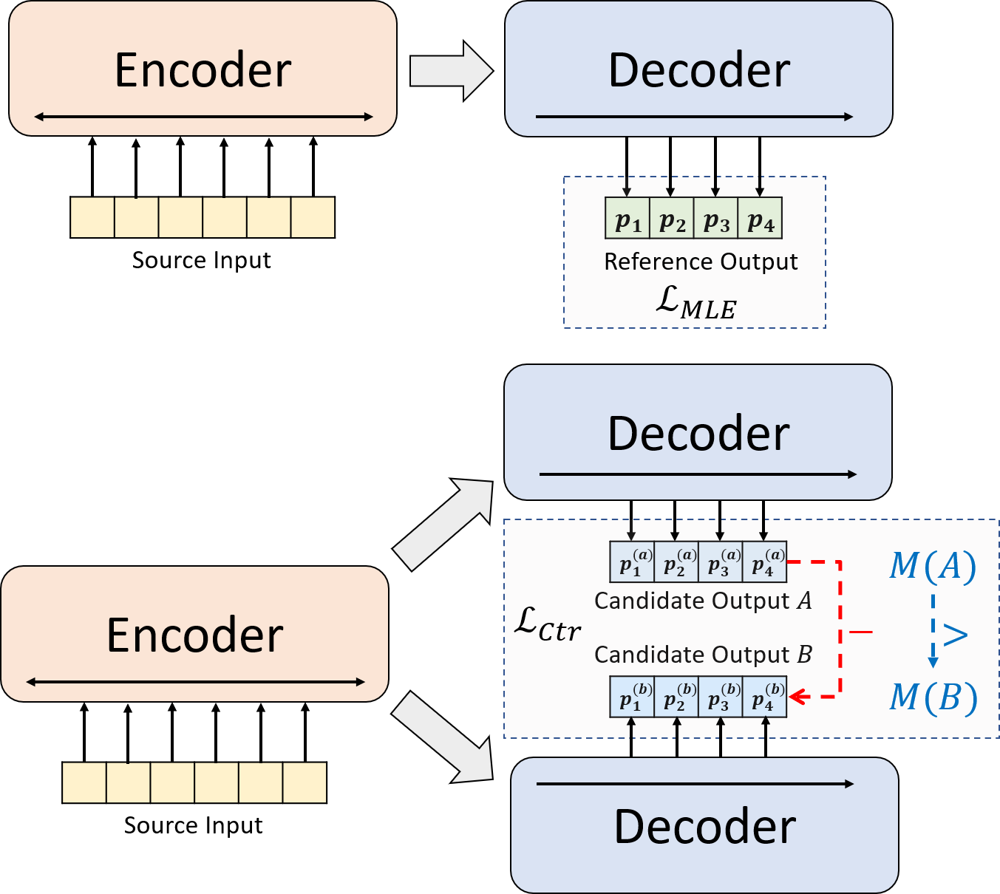

# BRIO: Bringing Order to Abstractive Summarization

This repo contains the code, data and trained models for our paper [BRIO: Bringing Order to Abstractive Summarization](https://arxiv.org/abs/2203.16804).

## Quick Links

- [Overview](#overview)
- [How to Install](#how-to-install)
- [Description of Codes](#description-of-codes)
  - [Workspace](#workspace)
- [Preprocessing](#preprocessing)
  - [Preprocessed Data](#preprocessed-data)
  - [Generate Candidate Summaries](#generate-candidate-summaries)
  - [Preprocess Your Own Data](#preprocess-your-own-data)
- [How to Run](#how-to-run)
  -  [Hyper-parameter Setting](#hyper-parameter-setting)
  -  [Train](#train)
  -  [Evaluate](#evaluate)
- [Results, Outputs, Checkpoints](#results-outputs-checkpoints)
- [Use BRIO with Huggingface](#use-brio-with-huggingface)

## Overview

We present a novel training paradigm for neural abstractive summarization.
Instead of using MLE training alone, we introduce a contrastive learning component, which encourages the abstractive models to estimate the probability of system-generated summaries more accurately.

<div  align="center">
 
</div>


## How to Install

- `python3.8`
- `conda create --name env --file spec-file.txt`
- Further steps
    - install additional libraries (after activating the conda env) `pip install -r requirements.txt`
    - `compare_mt` -> https://github.com/neulab/compare-mt
        ```console
        git clone https://github.com/neulab/compare-mt.git
        cd ./compare-mt
        pip install -r requirements.txt
        python setup.py install
        ```
Our code is based on Huggingface's [Transformers](https://github.com/huggingface/transformers) library. 

## Description of Codes
- `cal_rouge.py` -> ROUGE calculation
- `config.py` -> model configuration
- `data_utils.py` -> dataloader
- `label_smoothing_loss.py` -> label smoothing loss
- `main.py` -> training and evaluation procedure
- `model.py` -> models
- `modeling_bart.py`, `modeling_pegasus.py` -> modefied from Transformers library to support more efficient training
- `preprocess.py` -> data preprocessing
- `utils.py` -> utility functions
- `gen_candidate.py` -> generate candidate summaries


### Workspace
Following directories should be created for our experiments.
- `./cache` -> storing model checkpoints
- `./result` -> storing evaluation results

## Preprocessing

We use the following datasets for our experiments.

- CNN/DailyMail -> https://github.com/abisee/cnn-dailymail
- XSum -> https://github.com/EdinburghNLP/XSum
- NYT -> https://catalog.ldc.upenn.edu/LDC2008T19

### Preprocessed Data

You can download the preprocessed data for our experiments on [CNNDM](https://drive.google.com/file/d/10MyeEZVSgh38ot3O9mEhPWPqxLSJMoxA/view?usp=sharing), [CNNDM (cased)](https://drive.google.com/file/d/1NP0g9EG946Rp82e3zJyohCdey8NX-E7H/view?usp=sharing) and [XSum](https://drive.google.com/file/d/1LDbcRFGiZrzIMCfnLZ6Xyeym1Kv3TdmD/view?usp=sharing).

After donwloading, you should unzip the zip files in this root directory.

For NYT, you will need to get the license and please follow https://github.com/kedz/summarization-datasets for pre-processing.

### Generate Candidate Summaries

To generate the candidate summaries from a pre-trained model, please run
```console
python gen_candidate.py --gpuid [gpuid] --src_dir [path of the input file (e.g. test.source)] --tgt_dir [path of the output file] --dataset [cnndm/xsum] 
```

### Preprocess Your Own Data

For data preprocessing, please run
```console
python preprocess.py --src_dir [path of the raw data] --tgt_dir [output path] --split [train/val/test] --cand_num [number of candidate summaries] --dataset [cnndm/xsum/nyt] -l [lowercase if the flag is set]
```
`src_dir` should contain the following files (using test split as an example):
- `test.source`
- `test.source.tokenized`
- `test.target`
- `test.target.tokenized`
- `test.out`
- `test.out.tokenized`

Each line of these files should contain a sample except for `test.out` and `test.out.tokenized`. In particular, you should put the candidate summaries for one data sample at neighboring lines in `test.out` and `test.out.tokenized`.

**Notes**: after the data preprocessing, you should also put the raw file `test.source`, `test.target` into the created data folder (e.g. `./cnndm/diverse/test.source`)

We use the PTB tokenizer provided by Standford [CoreNLP](https://stanfordnlp.github.io/CoreNLP/index.html) ([download here](https://repo1.maven.org/maven2/edu/stanford/nlp/stanford-corenlp/3.8.0/stanford-corenlp-3.8.0.jar)). Please note that tokenized texts are *only* used for evaluation.
To tokenize a file, you may run (using test.source as an example)
```console
export CLASSPATH=/your_path/stanford-corenlp-3.8.0.jar
cat test.source | java edu.stanford.nlp.process.PTBTokenizer -ioFileList -preserveLines > test.source.tokenized
```

We have provided the examples files in `./examples/raw_data`.

The preprocessing procedure will store the processed data as seperate json files in `tgt_dir`.

#### Example: preprocessing test set on CNNDM

```console
# starting from the root directory

# create folders
mkdir ./cnndm
mkdir ./cnndm/diverse
mkdir ./cnndm/diverse/test

# suppose that the raw files are at ./raw_data, the results will be saved at ./cnndm/diverse/test
# please remember to put the source file and the target file on test set into the folder, e.g. ./cnndm/diverse/test.source

python preprocess.py --src_dir ./raw_data --tgt_dir ./cnndm/diverse --split test --cand_num 16 --dataset cnndm -l

```


## How to Run


### Hyper-parameter Setting
You may specify the hyper-parameters in `main.py`.
We also provide the specific settings on CNNDM (NYT share the same setting) and XSum in `config.py`.

### Train
```console
python main.py --cuda --gpuid [list of gpuid] --config [name of the config (cnndm/xsum)] -l 
```
The checkpoints and log will be saved in a subfolder of `./cache`.
#### Example: training on CNNDM
```console
python main.py --cuda --gpuid 0 1 2 3 --config cnndm -l 
```

#### Finetuning from an existing checkpoint
```console
python main.py --cuda --gpuid [list of gpuid] -l --config [name of the config (cnndm/xsum)] --model_pt [model path]
```
model path should be a subdirectory in the `./cache` directory, e.g. `cnndm/model.pt` (it shouldn't contain the prefix `./cache/`).

### Evaluate
For ROUGE calculation, we use the standard ROUGE Perl package from [here](https://github.com/summanlp/evaluation/tree/master/ROUGE-RELEASE-1.5.5) in our paper. We lowercased and tokenized (using PTB Tokenizer) texts before calculating the ROUGE scores. Please note that the scores calculated by this package would be sightly *different* from the ROUGE scores calculated/reported during training/intermidiate stage of evalution, because we use a pure python-based ROUGE implementation to calculate those scores for better efficiency. 

If you encounter problems when setting up the ROUGE Perl package (unfortunately it happens a lot :( ), you may consider using pure Python-based ROUGE package such as the one we used from the [compare-mt](https://github.com/neulab/compare-mt) package.

We provide the evaluation script in `cal_rouge.py`. If you are going to use Perl ROUGE package, please change line 13 into the path of your perl ROUGE package.
```python
_ROUGE_PATH = '/YOUR-ABSOLUTE-PATH/ROUGE-RELEASE-1.5.5/'
```

To evaluate the model performance, please first use the following command to generate the summaries.
```console
python main.py --cuda --gpuid [single gpu] --config [name of the config (cnndm/xsum)] -e --model_pt [model path] -g [evaluate the model as a generator] -r [evaluate the model as a scorer/reranker]
```
model path should be a subdirectory in the `./cache` directory, e.g. `cnndm/model.pt` (it shouldn't contain the prefix `./cache/`).
The output will be saved in a subfolder of `./result` having the same name of the checkpoint folder.

#### Example: evaluating the model as a generator on CNNDM
```console
# write the system-generated files to a file: ./result/cnndm/test.out
python main.py --cuda --gpuid 0 --config cnndm -e --model_pt cnndm/model_generation.bin -g

# tokenize the output file -> ./result/cnndm/test.out.tokenized (you may use other tokenizers)
export CLASSPATH=/your_path/stanford-corenlp-3.8.0.jar
cat ./result/cnndm/test.out | java edu.stanford.nlp.process.PTBTokenizer -ioFileList -preserveLines > ./result/cnndm/test.out.tokenized

# calculate the ROUGE scores using ROUGE Perl Package
python cal_rouge.py --ref ./cnndm/test.target.tokenized --hyp ./result/cnndm/test.out.tokenized -l

# calculate the ROUGE scores using ROUGE Python Implementation
python cal_rouge.py --ref ./cnndm/test.target.tokenized --hyp ./result/cnndm/test.out.tokenized -l -p
```

#### Example: evaluating the model as a scorer on CNNDM
```console
# rerank the candidate summaries
python main.py --cuda --gpuid 0 --config cnndm -e --model_pt cnndm/model_ranking.bin -r

# calculate the ROUGE scores using ROUGE Perl Package
# ./result/cnndm/reference and ./result/cnndm/candidate are two folders containing files. Each one of those files contain one summary
python cal_rouge.py --ref ./result/cnndm/reference --hyp ./result/cnndm/candidate -l

# calculate the ROUGE scores using ROUGE Python Implementation
# ./result/cnndm/reference and ./result/cnndm/candidate are two folders containing files. Each one of those files contain one summary
python cal_rouge.py --ref ./result/cnndm/reference --hyp ./result/cnndm/candidate -l -p
```


## Results, Outputs, Checkpoints

The following are ROUGE scores calcualted by the standard ROUGE Perl package. 

### CNNDM
|          | ROUGE-1 | ROUGE-2 | ROUGE-L |
|----------|---------|---------|---------|
| BART     | 44.29   | 21.17   | 41.09   |
| BRIO-Ctr     | 47.28   | 22.93   | 44.15   |
| BRIO-Mul     | 47.78   | 23.55   | 44.57   |
| BRIO-Mul (Cased)  | 48.01   | 23.76   | 44.63   |

### XSum
|          | ROUGE-1 | ROUGE-2 | ROUGE-L |
|----------|---------|---------|---------|
| Pegasus  | 47.46   | 24.69   | 39.53   |
| BRIO-Ctr     | 48.13   | 25.13  | 39.84   |
| BRIO-Mul    | 49.07   | 25.59   | 40.40   |

### NYT
|          | ROUGE-1 | ROUGE-2 | ROUGE-L |
|----------|---------|---------|---------|
| BART     | 55.78   | 36.61   | 52.60   |
| BRIO-Ctr     | 55.98   | 36.54  | 52.51   |
| BRIO-Mul    | 57.75  | 38.64   | 54.54   |

Our model outputs on these datasets can be found in `./output`.

We summarize the outputs and model checkpoints below.
You could load these checkpoints using `model.load_state_dict(torch.load(path_to_checkpoint))`.

|          | Checkpoints | Model Output | Reference Output |
|----------|---------|---------|---------|
| CNNDM    | [model_generation.bin](https://drive.google.com/file/d/1CEBo6CCujl8QQwRKtYCMlS_s2_diBBS6/view?usp=sharing) <br> [model_ranking.bin](https://drive.google.com/file/d/1vxPBuTUvxYqARl9C4wegVVS9g5-h7cwO/view?usp=sharing)   | [cnndm.test.ours.out](output/cnndm.test.ours.out) | [cnndm.test.reference](output/cnndm.test.reference)  |
| CNNDM (Cased)   | [model_generation.bin](https://drive.google.com/file/d/1YDUzNqbT6CC7VG3WfRspe2rM-j5DsjzT/view?usp=sharing)  | [cnndm.test.ours.cased.out](output/cnndm.test.ours.cased.out) | [cnndm.test.cased.reference](output/cnndm.test.cased.reference)  |
| XSum     | [model_generation.bin](https://drive.google.com/file/d/135V7ybBGvjOVdTPuYA1R65uNAN_UoeSL/view?usp=sharing) <br> [model_ranking.bin](https://drive.google.com/file/d/1GX6EQcI222NXvvQ8Z0gKQPmc64podbeC/view?usp=sharing) | [xsum.test.ours.out](output/xsum.test.ours.out) | [xsum.test.reference](output/xsum.test.reference)  |


## Use BRIO with Huggingface

You can load our trained models for *generation* from Huggingface Transformers.
Our model checkpoint on CNNDM (`Yale-LILY/brio-cnndm-uncased`, `Yale-LILY/brio-cnndm-cased`) is a standard BART model (i.e., [BartForConditionalGeneration](https://huggingface.co/docs/transformers/model_doc/bart#transformers.BartForConditionalGeneration)) while our model checkpoint on XSum (`Yale-LILY/brio-xsum-cased`) is a standard Pegasus model (i.e., [PegasusForConditionalGeneration](https://huggingface.co/docs/transformers/model_doc/pegasus#transformers.PegasusForConditionalGeneration)).

```python
from transformers import BartTokenizer, PegasusTokenizer
from transformers import BartForConditionalGeneration, PegasusForConditionalGeneration

IS_CNNDM = True # whether to use CNNDM dataset or XSum dataset
LOWER = False
ARTICLE_TO_SUMMARIZE = "Manchester United superstar Cristiano Ronaldo scored his 806th career goal in Old Trafford,\
 breaking FIFA's all-time record for most goals in competitive matches in men's football history.\
 It was the second of three goals the Portuguese attacker scored during the game,\
 leading United to a 3-2 victory over Tottenham and finishing the day with 807 total career goals.\
 The previous FIFA goal record was held by Josef Bican, with 805 goals."

# Load our model checkpoints
if IS_CNNDM:
    model = BartForConditionalGeneration.from_pretrained('Yale-LILY/brio-cnndm-uncased')
    tokenizer = BartTokenizer.from_pretrained('Yale-LILY/brio-cnndm-uncased')
else:
    model = PegasusForConditionalGeneration.from_pretrained('Yale-LILY/brio-xsum-cased')
    tokenizer = PegasusTokenizer.from_pretrained('Yale-LILY/brio-xsum-cased')

max_length = 1024 if IS_CNNDM else 512
# generation example
if LOWER:
    article = ARTICLE_TO_SUMMARIZE.lower()
else:
    article = ARTICLE_TO_SUMMARIZE
inputs = tokenizer([article], max_length=max_length, return_tensors="pt", truncation=True)
# Generate Summary
summary_ids = model.generate(inputs["input_ids"])
print(tokenizer.batch_decode(summary_ids, skip_special_tokens=True, clean_up_tokenization_spaces=False)[0])
```
*Notes*: our checkpoints on Huggingface *cannot* be directly loaded to the pytorch model (`BRIO`) in our code because our pytorch model is a wrapper on BART/PEGASUS for better training efficency. However, you can use it to initilize our pytorch model, e.g., 
```python
model = BRIO('Yale-LILY/brio-cnndm-uncased', tok.pad_token_id, is_pegasus=False)
```
